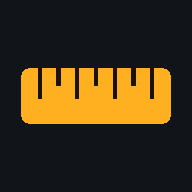
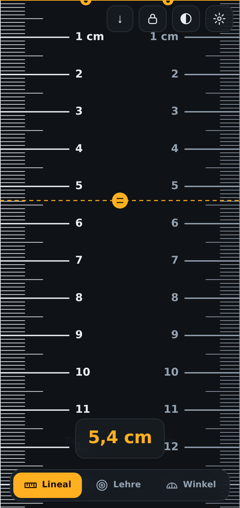
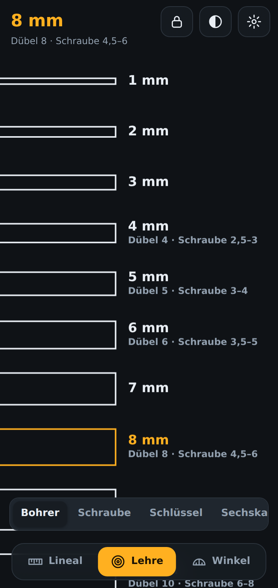
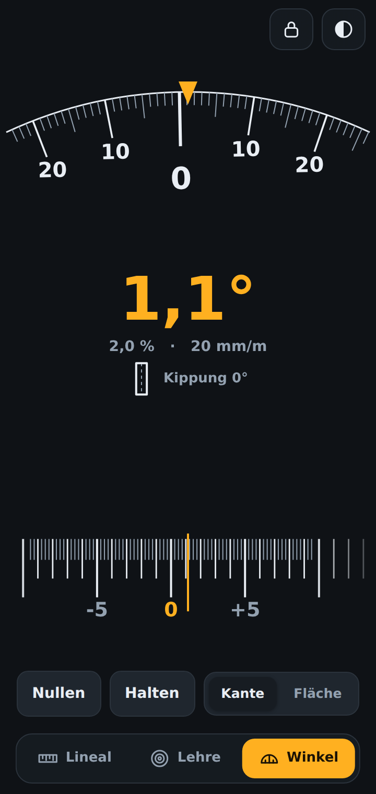

# Zollstock 📐

Zollstock ist dein Messwerkzeug für die Hosentasche: ein Lineal in
Originalgröße auf dem Display, eine Lehre für Bohrer, Schrauben und Rohre und
ein Winkelmesser, der die Lage des Geräts ausliest. Einmal kalibriert zeigt
dein Handy echte Millimeter – und sagt dir auch, welcher Dübel in dieses Loch
gehört.

Kurz gesagt: Das Werkzeug, das du sowieso in der Tasche hast, weiß plötzlich,
wie dick dieser Bohrer ist.

| Lineal | Messlehre | Winkelmesser |
| --- | --- | --- |
|  |  |  |

## Was Zollstock für dich macht

- **In Originalgröße messen** – die Zentimeterteilung steht an beiden Kanten,
  du kannst also von jeder Seite anlegen.
- **Dort anfangen, wo es passt** – der Nullpunkt wandert von der Gerätekante
  über den Bildschirmrand bis in die Mitte. Auch Werkstücke, die sich nicht
  ans Gehäuse legen lassen, bekommen einen sichtbaren Nullstrich.
- **Bohrer, Schrauben und Rohre bestimmen** – auflegen, die passende Form
  suchen, ablesen. Daneben steht, was dazugehört: Dübel, Kernloch,
  Schlüsselweite.
- **Winkel und Gefälle messen** – Gerätekante anlegen oder flach auflegen.
  Nahe der Waagerechten rechnet die App in Prozent und mm/m um, so wie es auf
  dem Bau vorgegeben wird.
- **Ohne Hinsehen arbeiten** – die Haltetaste friert den Wert ein, und bei 0°
  und 45° gibt das Gerät einen Stups. Praktisch dort, wo du den Bildschirm
  beim Anlegen nicht siehst.
- **Hell oder dunkel anlegen** – ein dunkler Bohrer auf schwarzem Grund ist
  kaum zu beurteilen; ein Knopf macht die Fläche weiß.
- **Wissen, wie genau es ist** – die App sagt dir, was sie erkannt hat, wie
  sicher sie ist, und lässt dich den Maßstab mit einer Karte nachprüfen.
- **Offline dabeihaben** – Zollstock ist eine PWA, lässt sich zum
  Startbildschirm hinzufügen und braucht danach kein Netz mehr. Die zuletzt
  benutzte Ansicht ist beim nächsten Start wieder da.

## Für wen ist das?

Zollstock passt zu dir, wenn du ...

- öfter mal schnell nachmisst und der Zollstock gerade im Keller liegt,
- vor dem Regal stehst und wissen willst, welcher Dübel in welches Loch gehört,
- ein Rohr oder eine Mutter bestimmen musst, ohne Messschieber in Reichweite,
- ein Rohr mit Gefälle verlegst oder ein Brett gerade haben willst,
- ein Werkzeug magst, das dir sagt, wo seine Grenzen liegen, statt eine
  Nachkommastelle vorzutäuschen.

## Loslegen

Zollstock ist eine einzelne statische Seite – kein Build, keine
Abhängigkeiten, kein Konto. Du kopierst das Verzeichnis auf deinen Webspace
und rufst die Adresse auf – mehr braucht es nicht.

1. **Seite öffnen.**
2. **Zum Startbildschirm hinzufügen.** Als installierte App läuft Zollstock im
   Vollbild – nur dann reicht der Bildschirm bis an den Rand, und nur dann
   stimmt das Messen an der Gerätekante.
3. **Einmal den Maßstab prüfen.** Einstellungen (Zahnrad) → *Maßstab prüfen*,
   EC-Karte anlegen. Zehn Sekunden, und du weißt, ob die Erkennung stimmt.

## Ein erster Rundgang

### 1. Den Maßstab prüfen

Zollstock erkennt die meisten Geräte selbst und rechnet mit der Pixeldichte
des Herstellers. Das ist ein guter Startwert, aber ungeprüft: Beim Galaxy S22
etwa unterscheiden sich die beiden kursierenden Diagonalen um 0,8 mm auf die
Bildschirmlänge.

Die Probe legt eine EC-Karte (genormt 85,6 × 54,0 mm) bündig an eine feste
Linie, du schiebst eine zweite auf ihr anderes Ende. Daneben steht, wie weit
der Maßstab danebenliegt – *Übernehmen* korrigiert ihn. Steht dort `0,0 mm`,
heißt der Knopf **Passt**, und du weißt es statt es zu hoffen.

### 2. Messen

Tippen setzt die Messmarke, Ziehen verschiebt sie. Liegt die Null im
sichtbaren Bereich, steht sie als durchgezogene Linie quer über dem
Bildschirm – daran wird angelegt.

Der Knopf mit dem Pfeil schaltet den Nullpunkt weiter, von einer Kante zur
anderen. Die Marke bleibt dabei liegen und ihre Zahl wandert: Du legst sie
einmal auf ein Merkmal und liest ab, was es von der anderen Kante aus misst.

### 3. Bohrer, Schraube, Rohr bestimmen

In der Lehre legst du den Bohrer waagerecht in den Schlitz, der ihn genau
ausfüllt. Die Mutter kommt auf den Sechskant und wird gedreht, bis er deckt.
Das Rohr hältst du an den linken Bildschirmrand, wo Halbkreise liegen.

Neben jedem Maß steht, was dazugehört – `6 mm · Dübel 6 · Schraube 3,5–5`
oder `SW 8 · Mutter M5 · Inbus M10`.

### 4. Winkel und Gefälle

Gerätekante ans Werkstück anlegen (**Kante**) oder das Gerät flach auflegen
(**Fläche**). Nahe der Waagerechten steht unter der Gradzahl das Gefälle in
Prozent und mm/m.

**Nullen** macht die aktuelle Lage zur Null – anlegen, nullen, alles Weitere
zählt von dort. Im Flächenmodus heißt derselbe Knopf **Fläche merken**: Gerät
auf die erste Fläche legen, merken, auf die zweite legen, Winkel ablesen.

## Genau messen: Kalibrierung und Gerätekante

Unter dem Zahnrad liegen alle Wege zum Maßstab:

| Weg | Wofür? |
| --- | --- |
| **Maßstab prüfen** | Der empfohlene. Karte an die Linie, zweite Linie auf ihr Ende. Sagt, wie weit es danebenliegt, und korrigiert auf Wunsch. |
| **Karte anlegen** | Derselbe Bezug als Umriss, den ein Regler auf die Karte zieht. |
| **Linie messen** | Eine Referenzlinie mit einem echten Lineal messen und die Länge eintragen. |
| **PPI eingeben** | Herstellerangabe zur Pixeldichte direkt eintragen. |

Die Probe ist die genauere Handhabung: Beim Umriss müssen zwei Kanten
gleichzeitig zur Deckung kommen, während ein Regler die Größe ändert – hier
liegt eine Kante fest an, und nur das andere Ende wird angefahren. Die
Abweichung steht als Zahl daneben, so wird auch ein halber Millimeter
sichtbar.

**Die Gerätekante** ist der Rand zwischen dem Gehäuse (mit Hülle, wenn eine
drauf ist) und dem ersten Bildpunkt. Ist er bekannt, beginnt die Skala dort
statt am Bildschirmrand – dann kannst du das Werkstück ans Gehäuse legen.
Gemessen wird er mit derselben Karte als Lückenfüller:

```
Rand = Kartenlänge − sichtbarer Anteil
```

Ober- und Unterkante werden getrennt gemessen. Das Display sitzt selten mittig
im Gehäuse – die Kinnleiste unten ist meist der breitere Rand –, und Hüllen
sind unten oft anders ausgeschnitten als oben, wo die Kamera sitzt. Ein bis
zwei Millimeter Unterschied sind normal.

## Der Nullpunkt

Der Knopf in der Kopfzeile schaltet weiter, von einer Kante zur anderen:

| Lage | Null liegt |
| --- | --- |
| oben, an der Gerätekante | an der Oberkante des Geräts, außerhalb des Bildschirms |
| oben, am Bildschirmrand | am ersten Bildpunkt |
| oben, 1 cm vom Rand | einen Zentimeter innerhalb des Bildschirmrands |
| mittig | in der Bildschirmmitte, zählt nach beiden Seiten |
| unten, 1 cm vom Rand | einen Zentimeter innerhalb der Unterkante |
| unten, am Bildschirmrand | am letzten Bildpunkt |
| unten, an der Gerätekante | an der Unterkante des Geräts |

Eine Gerätekante erscheint nur, wenn ihr Rand vermessen ist – oben und unten
unabhängig voneinander. Die Lagen *1 cm vom Rand* sind für Werkstücke gedacht,
die sich nicht ans Gehäuse legen lassen: Der Nullstrich liegt sichtbar auf dem
Bildschirm, das Werkstück wird daran ausgerichtet. *Mittig* zählt nach beiden
Seiten und hilft beim Mittigfinden.

Der Knopf zeigt als Pfeil, wo die Null sitzt und wohin gezählt wird (↓ ↑ ↕, im
Querformat → ← ↔), dazu `K` für Gerätekante und `1` für den Zentimeter
Abstand. Beim Wechseln wird die Lage kurz ausgeschrieben.

## Die Messlehre

Sechs Sätze, umschaltbar unter der Anzeige:

| Satz | Form | Maße |
| --- | --- | --- |
| **Bohrer** | Schlitze | 1–16 mm, mit Dübel und Schraube |
| **Schraube** | Schlitze | metrisches Regelgewinde M3–M16, mit Kernloch und Schlüsselweite |
| **Schlüssel** | Schlitze | Schlüsselweiten SW 1,5 – SW 24 |
| **Sechskant** | Sechsecke | dieselben Weiten als Umriss zum Auflegen |
| **Rohr mm** | Halbkreise | Kupfer nach EN 1057 und Verbund-/PE-Rohre |
| **Rohr Zoll** | Halbkreise | Gewinderohre nach EN 10255 / DIN 2440, ⅛″ bis 3″ |

Alles steht als Liste untereinander, jedes Maß am linken Bildschirmrand;
durchgeblättert wird durch Scrollen. Ein Tipp hebt ein Maß hervor.

**Warum das genau genug ist:** Die Striche eines Schlitzes stehen außerhalb
des Nennmaßes, die lichte Weite dazwischen ist deshalb auf den
Zehntelmillimeter genau der Nennwert. Du vergleichst also unmittelbar, statt
abzulesen – und siehst sofort, ob der Bohrer den Schlitz ausfüllt oder
übersteht. Halbe Millimeter gibt es bewusst nicht: So genau lässt sich ein
Bohrer von Hand nicht anlegen, und eine Zahl vorzugaukeln, die nicht trägt,
hilft niemandem.

**Rohre** hältst du an die Kante und vergleichst mit einem Halbkreis, dessen
Mittelpunkt auf ihr liegt – die andere Hälfte ragt über den Rand hinaus. So
braucht ein Maß nur den halben Platz in der Breite, und auch 3″ (88,9 mm)
passt auf ein Handy. Ausgerichtet wird an den beiden kurzen Strichen, die die
Enden des Durchmessers markieren.

Bei Rohren sind alle Maße **Außendurchmesser**. Die Zollangabe ist der
Gewindename, nicht das Maß: ½″ hat 21,3 mm außen, 1″ hat 33,7 mm. Die Anzeige
nennt deshalb beides.

**Sechskant statt Schlitz:** Die Mutter auflegen und drehen, bis der Umriss
deckt, prüft beide Maße auf einmal – Schlüsselweite und Eckenmaß –, während
ein Schlitz nur die Weite kennt und dafür parallel ausgerichtet sein will. Ein
Inbusschlüssel ist selbst ein Sechskant, deshalb fängt die Reihe bei SW 1,5 an.

## Der Winkelmesser

Aus dem Lagesensor wird die Richtung „oben“ berechnet, daraus zwei Messarten:

| Messart | Hauptwert | so wird angelegt |
| --- | --- | --- |
| **Kante** | Drehung in der Bildschirmebene | Gerätekante ans Werkstück |
| **Fläche** | Neigung der Auflagefläche | Gerät flach auflegen |

Angezeigt wird auf zwei Skalen: grob als Bogen mit Gradstrichen, der wie ein
Lot im Raum stehen bleibt, während der feste Zeiger oben den Wert abgreift –
fein als Bandskala darunter, die alle 45° eine Null hat und in
Viertelgrad-Schritten zählt. Im Flächenmodus tritt eine Dosenlibelle an die
Stelle des Bogens; ihr Bereich richtet sich nach der Abweichung.

**Gefälle** steht unter der Gradzahl, sobald es näher als 20° an der
Waagerechten liegt: `2,0 % · 20 mm/m`. Das ist die Einheit, in der es auf dem
Bau vorgegeben wird – Abwasser 2 %, Terrasse 2 %, Dachrinne 3 mm/m. Weiter
davon weg sagt ein Prozentwert nichts mehr (68° wären 247 %), dort steht
stattdessen, wie weit es bis zum rechten und bis zum gestreckten Winkel ist.

**Nullen** macht die aktuelle Lage zur Null, ohne Rundung. Der Nullpunkt hängt
dabei am Gerät, nicht am Bildschirm: Wer gegen eine Kante nullt und das Gerät
danach dreht, will den tatsächlichen Abstand zu dieser Kante sehen.

**Fläche merken** speichert eine Bezugsfläche: Gerät auflegen, drücken, auf die
zweite Fläche legen – angezeigt wird der Winkel zwischen beiden. Der Lagesensor
kennt nur die Richtung der Schwerkraft, nicht die Himmelsrichtung; gemessen
wird deshalb der Winkel, um den das Gerät zwischen beiden Auflagen gekippt
wurde. Solange du es dabei nicht um die Senkrechte drehst, ist das genau der
Winkel zwischen den Flächen.

**Halten** friert die Lage ein, bis erneut gedrückt wird – gedacht für Stellen,
an denen das Gerät angelegt werden muss, ohne dass man den Bildschirm sieht.
Ein Tipp auf die Skala tut dasselbe. Dazu passt der **Stups** auf jeder
45er-Marke: Die Null bekommt zwei, damit sie sich unterscheidet. Geräte ohne
`navigator.vibrate` (iOS) bleiben still – und ein eingeschaltetes „Nicht
stören“ schluckt ihn auch.

Auf iOS muss der Zugriff auf den Lagesensor einmal bestätigt werden; dafür
erscheint eine Schaltfläche.

## Drehsperre und heller Grund

Zwei Knöpfe in der Kopfzeile, die beim Anlegen helfen:

Das **Vorhängeschloss** sperrt den Bildschirm auf die Lage, in der das Gerät
gerade ist – sonst kippt beim Anlegen ständig die Ansicht weg. Chrome erlaubt
das nur einer installierten App oder im Vollbild; läuft Zollstock im
Browsertab, holt es sich das Vollbild dazu und verlässt es beim Freigeben
wieder. Auf iOS gibt es die Schnittstelle nicht, dort erscheint der Knopf
gar nicht erst.

Der **halb gefüllte Kreis** macht die Fläche weiß. Ein dunkler Bohrer vor
schwarzem Bildschirm ist kaum zu beurteilen, vor Weiß steht sein Umriss – und
bei Sonne ist es ohnehin besser lesbar.

## Wie genau ist das?

Ehrlich gesagt: so genau wie deine Kalibrierung, nicht genauer.

- **Ungeprüft** rechnet die App mit der Herstellerangabe zur Pixeldichte. Das
  liegt meist unter einem Prozent daneben – auf 10 cm also unter einem
  Millimeter, aber eben ungeprüft. Unter *Einstellungen → Kalibrierung* steht,
  was erkannt wurde und wie sicher.
- **Nach der Probe mit der Karte** liegt der Maßstab auf etwa zwei Zehntel
  je 10 cm genau – die Karte ist 85,6 mm lang, ein Bildpunkt daneben sind
  zwei Promille.
- **Die Nulllinie** liegt am Rand des sichtbaren Bereichs, nicht am
  Gehäuserand. Im Browser verschiebt die Adressleiste diesen Rand – für
  randgenaues Messen die App zum Startbildschirm hinzufügen.
- **Der Winkelmesser** hängt am Beschleunigungssensor; ruhig gehalten sind das
  ein bis drei Zehntelgrad.

Während des Messens hält die App den Bildschirm wach, soweit der Browser das
unterstützt.

Viel Erfolg beim Messen, Bohren und Geradehängen. 📐

---

## Technische Doku

Dieser Abschnitt ist für alle gedacht, die verstehen wollen, woher die
Millimeter kommen, oder die selbst am Code arbeiten.

### Wie die Originalgröße zustande kommt

Browser geben die physische Pixeldichte nicht direkt preis. Verfügbar sind nur:

| Wert | Bedeutung |
| --- | --- |
| `screen.width` / `screen.height` | logische Auflösung in CSS-Pixeln |
| `devicePixelRatio` | Verhältnis physischer zu logischen Pixeln |
| Modell aus User-Agent bzw. Client Hints | nur Android, z. B. `SM-S911B` |

Daraus leitet `js/devices.js` die Pixeldichte ab:

```
physische Pixel     = CSS-Pixel × devicePixelRatio
CSS-Pixel pro Zoll  = ppi ÷ devicePixelRatio
CSS-Pixel pro mm    = ppi ÷ devicePixelRatio ÷ 25,4
```

**Android** nennt sein Modell – damit wird die Dichte in einer Modelltabelle
nachgeschlagen (Galaxy S/Note/A/Z, Pixel). Chrome kürzt den User-Agent
allerdings auf `Android 10; K`; das echte Modell liefert dann erst
`navigator.userAgentData.getHighEntropyValues(['model'])`, und zwar asynchron –
die App reicht die Korrektur nach. Meldet das Gerät weniger Pixel als das
Panel hat (etwa FHD+ statt WQHD+ eingestellt), wird die Dichte im selben
Verhältnis heruntergerechnet.

**Apple** nennt kein Modell, dort sind CSS-Auflösung und Pixelverhältnis je
Gerät aber eindeutig. Diese Tabelle gilt ausschließlich für iOS: Die Schlüssel
sind nicht herstellerübergreifend eindeutig – ein Galaxy S22 meldet mit
360 × 780 bei dpr 3 genau dasselbe wie ein iPhone 13 mini.

Ohne Treffer greift die Konvention der Plattform (Mobilgeräte ≈ 160 dpi,
Desktop = 96 dpi). Das ist nur eine Näherung, deshalb weist die App dann auf
die Kalibrierung hin. Eine Kalibrierung überstimmt die Erkennung immer und
liegt in `localStorage` (`zollstock.calibration.v1`).

### Die Gerätekante beim Drehen

Das Lineal zählt in Bildschirmkoordinaten – sein Anfang liegt oben bzw. links.
Welche Gerätekante dort liegt, sagt aber erst die Drehung des Bildes:

| `screen.orientation.angle` | Anfang des Lineals | dort liegt |
| --- | --- | --- |
| 0° | oben | Oberkante |
| 90° | links | Oberkante |
| 180° | oben | Unterkante |
| 270° | links | Unterkante |

In beiden Querformaten läuft das Lineal an der langen Achse, seine Enden sind
also weiterhin Ober- und Unterkante – nur seitlich, und bei 270° vertauscht.
`Edge.edgeAt()` löst das auf; ohne diese Zuordnung rechnete die Skala in zwei
von vier Lagen mit dem Rand der falschen Kante.

### Woher der Winkel kommt

Aus `beta` und `gamma` des Lagesensors wird die Richtung „oben“ im
Gerätesystem berechnet (dritte Zeile der Drehmatrix Z-X'-Y''):

```
ux = −cos(beta) · sin(gamma)
uy =  sin(beta)
uz =  cos(beta) · cos(gamma)
```

Senkrecht im Hochformat ergibt das (0, 1, 0), flach auf dem Tisch (0, 0, 1).
Daraus folgen beide Messarten: die Drehung in der Bildschirmebene als
`atan2(−ux, uy)`, die Neigung der Auflagefläche als `acos(|uz|)`.

Dreht das Betriebssystem die Ansicht mit, muss die Lage in dasselbe System
gebracht werden. `screen.orientation.angle` zählt, um wie viel das **Bild** im
Uhrzeigersinn gedreht ist; das alte `window.orientation` von iOS zählt
andersherum und wird umgerechnet. Beide Fragen – die nach der Gerätekante und
die nach dem Winkel – beantwortet `Scales.angle()`.

Für die gemerkte Bezugsfläche wird die kürzeste Drehung gesucht, die „oben“
der Bezugsfläche auf die Senkrechte bringt (Formel von Rodrigues); auf den so
gekippten Vektor wirken Hauptwert und Libelle genauso wie sonst auf den
ungedrehten.

### Aufbau

```
index.html              Gerüst aller Ansichten
css/style.css           Darstellung, heller und dunkler Grund
js/devices.js           Bildschirmerkennung, Gerätetabellen
js/calibration.js       Kalibrierung inkl. Vollbild-Kartenabgleich
js/check.js             Maßstabsprobe an der Karte
js/scales.js            Skalenteilung, Lage des Nullpunkts, Bildschirmdrehung
js/edge.js              Randversatz, je Wert für Ober- und Unterkante
js/ruler.js             Lineal (Canvas)
js/gauge.js             Messlehre für Bohrer, Schrauben und Rohre
js/protractor.js        Winkelmesser (Lagesensor, Ring- und Bandskala)
js/app.js               Ansichtswechsel, Bedienelemente, Service Worker
sw.js                   Offline-Cache
manifest.webmanifest    PWA-Manifest
scripts/make-icons.js   erzeugt die PNG-Icons (node scripts/make-icons.js)
tests/                  Prüfstrecke – gehört nicht zur App
```

Kein Build, keine Abhängigkeiten. Die Zeichenflächen holen ihre Farben zur
Laufzeit aus dem Stylesheet, ein Neuzeichnen genügt deshalb beim Wechsel des
Grundes.

### Prüfstrecke

```bash
cd tests
npm install
npm test
```

Geprüft wird, was sich nachrechnen lässt: die lichten Weiten der Schlitze, die
Maße der Sechskante und Halbkreise, wo die Null im Lineal sitzt, die
Umrechnungen des Winkelmessers, ob die Messfläche bis an die Bildschirmkante
reicht, ob Gemerktes ein Neuladen übersteht. 58 Behauptungen in sechzehn
Prüfungen; ein Teilwort als Argument läuft nur die passenden
(`npm test lehre`).

Gemessen wird in den Bildpunkten der Zeichenfläche – über die Schwerpunkte der
gezeichneten Striche, weil die gegen Kantenglättung unempfindlich sind. Der
Maßstab wird dafür fest auf 5,5 px/mm gesetzt, damit die Erwartungswerte nicht
am erkannten Gerät hängen.

Die Prüfstrecke braucht `playwright-core` und einen Chromium. Ihre
`package.json` liegt in `tests/`, damit das Projekt selbst ohne Build und ohne
Abhängigkeiten bleibt. Gefunden wird der Browser über `CHROME_PATH`, über
`PLAYWRIGHT_BROWSERS_PATH` oder an den üblichen Orten; sonst hilft
`npx playwright install chromium`.

**Was sie nicht kann:** Sie sieht nicht, dass „Nicht stören“ das Vibrieren
abwürgt, ob die Pixeldichte für dieses Display stimmt oder ob ein Bohrer
wirklich in den Schlitz passt. Sie prüft Rechnung und Anordnung, nicht die
Physik – das Handy bleibt die letzte Instanz.

### Aufspielen

Das Verzeichnis auf den eigenen Webspace kopieren, fertig. Alle Pfade sind
relativ, es läuft also in jedem Unterordner. `tests/` und `docs/` gehören
nicht dazu – sie werden im Betrieb nicht gebraucht.

Eine neue Fassung lädt sich selbst nach, sobald sie übernommen hat und gerade
niemand hinsieht: beim Weglegen, damit sie beim nächsten Hinsehen da ist.
Solange die App im Bild ist, bleibt es beim antippbaren Hinweis, damit
niemandem mitten in der Messung der Bildschirm wegspringt.

Welche Fassung wirklich läuft, steht unten in den Einstellungen als
**Stand:** – damit lässt es sich feststellen, statt es zu vermuten.

### Stand

- [x] Lineal in Originalgröße, Zentimeterteilung an beiden Kanten
- [x] Bildschirmerkennung und Kalibrierung, Maßstabsprobe an der Karte
- [x] Randversatz je Wert für Ober- und Unterkante
- [x] Messlehre für Bohrer, Schrauben, Schlüsselweiten, Sechskant und Rohre
- [x] Winkelmesser über den Lagesensor, grobe und feine Skala, zwei Messarten
- [x] Gefälle in Prozent und mm/m nahe der Waagerechten
- [x] Drehsperre und heller Grund
- [x] Offline-Betrieb, installierbar, lädt neue Fassungen selbst nach
- [x] Prüfstrecke unter `tests/`

## Lizenz

[MIT](LICENSE)

Fremder Code ist nicht enthalten: keine Bibliotheken, kein Build-Schritt, die
Icons erzeugt `scripts/make-icons.js` selbst.
